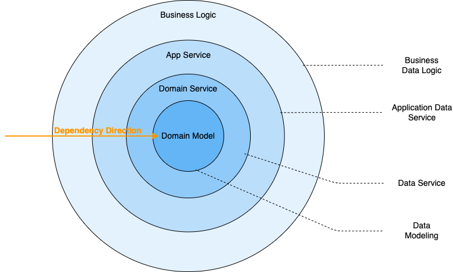

# Architecture Design

Based on [Clean Architecture on Frontend](https://dev.to/bespoyasov/clean-architecture-on-frontend-4311) and concepts from Domain-Driven Design (DDD), this project has adopted the following layered architecture:

Through data modeling, domain models are established. Based on these domain models, domain services are constructed. Application services and business logic belong to the application layer, which depends on domain services and domain models.

This architecture model stipulates: only outer layers can depend on inner layers. This means:

- The domain must be independent;
- The application layer can depend on the domain;
- The outermost layer can depend on anything;

Code that does not control the direction of dependencies can become very complex and difficult to maintain. For example:

- Circular dependencies, where module A depends on B, B depends on C, and C depends on A;
- Poor testability, where even testing a small piece of functionality requires mocking the entire system;
- High coupling, making interactions between modules very fragile;

:::note
**Why adopt a DDD architecture design?**

DDD can essentially be seen as a means to reduce software complexity. Its recommended methodology can better unify business complexity and technical complexity, standardizing fundamental programming paradigms. A layered architecture designed based on DDD offers advantages in maintainability and scalability. For more details, refer to [Clean Architecture on Frontend](https://dev.to/bespoyasov/clean-architecture-on-frontend-4311).
:::
